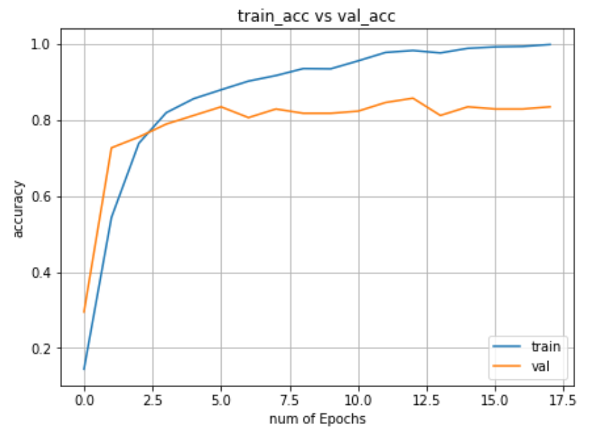

# hand digits classifier

## about the model
This model is built with 2 convolution layers on around 1700 hand digit images. 
This model has a accuracy more than 82% on test and validation set.

## about the dataset
This dataset is downloaded from kaggle weblsite.
The data set can be downloaded from the zip file in this repository.
This data set contains 10 classes from 0 to 10 hand signs
This data set contain total of 2062 examples (including training ,validation and testing sets).

## preview of this data set

0   1   2 

## plots
### loss function vs the number of epochs

### accuracy vs the number of epochs

